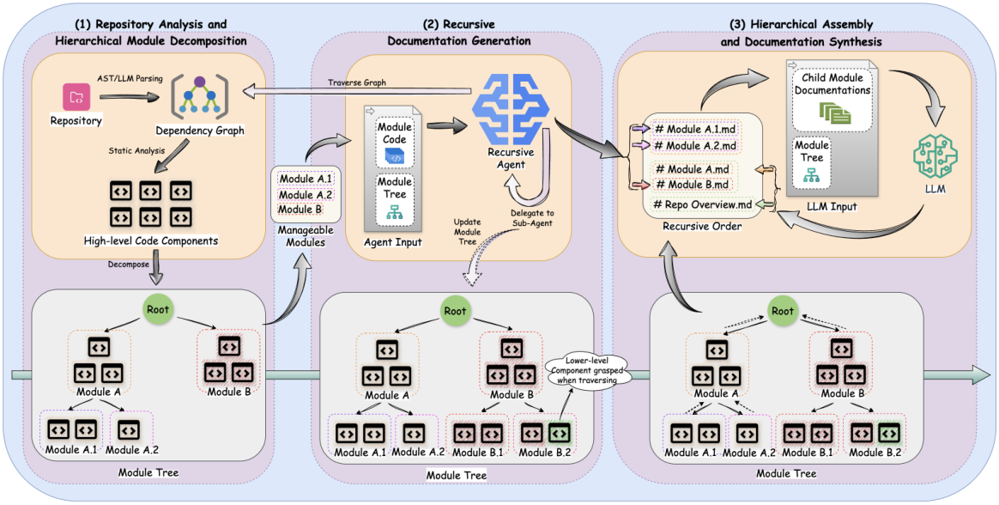
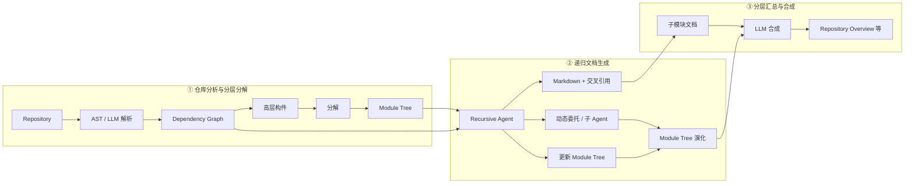
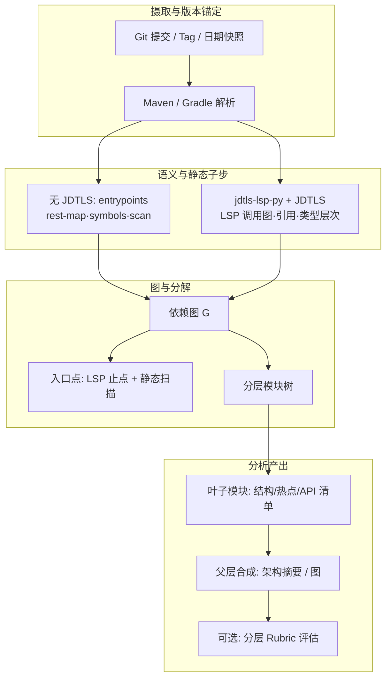

# 历史 Java 工程分析系统设计文档

本文档基于论文 *CodeWiki: Evaluating AI’s Ability to Generate Holistic Documentation for Large-Scale Codebases*（arXiv:2510.24428，2026）的方法论与开源生态，将「仓库级理解与分层文档」思路迁移为**历史 Java 代码库的结构化分析**方案。论文核心仓库：<https://github.com/FSoft-AI4Code/CodeWiki>。

**语言范围**：实现路径**仅保留 Java**（Maven / Gradle 多模块与单体），不再按论文做多语言统一解析栈；论文中的 **Tree-Sitter** 角色由 **`jdtls-lsp-py` + Eclipse JDTLS** 承担（见 **§5.0**）。

**论文 Figure 1（原图）** — *CodeWiki Framework Architecture Overview*，自 `CodeWiki_paper.pdf` 第 2 页导出。

*位图路径：`docs/images/codewiki-paper-page2.png`（由 `docs/CodeWiki_paper.pdf` 第 2 页导出；项目根目录 `.venv-pdf` + PyMuPDF 可重跑）。*

---

## 1. 目标与范围

### 1.1 业务目标

对**已冻结或演进中的历史 Java 工程**（单模块或多模块 Maven/Gradle 仓库、遗留单体、内部库集合）完成可复现的分析产出，包括但不限于：

- 依赖与调用关系视图（包、类、模块边界）
- 入口与对外 API 识别（`main`、Spring 端点、公开 SPI 等）
- 按功能/架构边界的**分层模块树**（便于人工审阅与后续自动化）
- 可选：与官方/遗留文档对齐的**质量或覆盖度**评估（借鉴 CodeWikiBench 思路）

### 1.2 非目标（首期）

- 不承诺替代专业安全审计或性能剖析工具
- 不把「生成面向最终用户的 Wiki」作为唯一交付物；分析管线可与文档生成解耦或组合

---

## 2. 与 CodeWiki 的对齐关系

论文中 CodeWiki 三阶段与本文分析的映射如下。

| CodeWiki 阶段 | 历史 Java 分析中的对应工作 |
|----------------|---------------------------|
| **仓库分析**：AST 解析、依赖图、分层分解 | **jdtls-lsp-py** 驱动 **JDTLS**：`references` / `callHierarchy`（`incomingCalls`·`outgoingCalls`）/ `typeHierarchy` / `documentSymbol` 等构图；辅以 **无 JDTLS** 的 `reverse-design scan`·`symbols`、`entrypoints`、`rest-map`；Maven/Gradle 模块边界与递归「分析子树」 |
| **递归生成**（文档/说明） | 可选：对叶子模块生成结构化分析报告（Markdown/JSON），复杂度过高时子任务拆分（类比动态委托） |
| **分层汇总** | 自底向上合并子模块分析为包级、模块级、仓库级摘要与架构图 |

论文强调的统一依赖关系 **`depends_on`**（跨语言泛化）在 Java 侧仍作为边类型的**逻辑名**：调用、继承、实现、字段/方法引用等均归一到有向图 \(G=(V,E)\)；**物理采集**以 LSP 结果与模块扫描为主（**§5.0**），不再依赖 Tree-Sitter 语法树。

---

## 3. 论文核心要点摘录（CodeWiki）

以下为论文正文与附录中**与本设计直接相关**的机制归纳，便于实现与评审对照原文（arXiv:2510.24428，v6 标注 2026-04）。

### 3.1 问题设定与动机

- **仓库级文档**不同于函数级/文件级：需要捕获架构模式、跨模块交互、数据流与系统级设计决策；且需服务多类读者（从高层概览到实现细节）。
- **整仓单次提示**类方法（论文对比的 OpenDeepWiki、deepwiki-open 等）在更大、更复杂仓库上质量与**需求覆盖**明显变差，论文归因于**上下文窗口限制**与**缺乏分层一致性**。

### 3.2 上下文爆炸：如何应对（§3.1–3.2，附录 C、G）

| 要点 | 论文中的做法 | 映射到历史 Java 分析 |
|------|----------------|----------------------|
| **分层分解** | 受动态规划思想启发：把仓库拆成可管理的模块子树，同时保留架构语境；分解时**只把组件 ID** 喂给分解逻辑，控制输入规模。 | Maven/Gradle 模块边界 + 包/类型图上的递归切分；大模块继续拆。 |
| **有界叶子** | 附录 G：每个叶子模块约 **32 768 tokens** 的上限（与所用模型窗口配套）。 | 可换算为 token 预算，或等价的 LOC / 类型数 / 圈复杂度之和上限。 |
| **递归与动态委托** | 叶子模块若超出单次处理能力，由 Agent **委派**给子 Agent；触发依据包括：**圈复杂度、嵌套深度、语义多样性**（功能上可区分的子部分）、**上下文窗口占用**；**模块树在运行中更新**；附录 G：**最大委托深度 3**。处理顺序为**自底向上**（附录 Algorithm 1：先叶子，委派则插入子叶子并递归，再修订父文档）。 | 无 LLM 时可改为**确定性拆分**（按包/目录/扇出阈值）；有 LLM 时沿用同一「过重再拆」控制环。 |
| **先构图再切分** | 有向图 \(G=(V,E)\)，调用/继承/属性访问/导入等统一为 **`depends_on`**。 | 与本文 **§5.1** 一致（Java 侧由 **§5.0** 工具链填充）。 |
| **入口点** | **拓扑排序**得到**零入度**构件作为用户交互入口（`main`、API、CLI、公开接口等），用于理解系统从外到内的路径。 | 与本文 **§5.2** 一致，可叠加 Spring/SPI 等规则。 |

论文 **RQ3** 的结论要点：在 **86K～约 1.4M LOC** 的基准上，同语言族内**仓库体量本身往往不是首要瓶颈**；表现更多随**语言与解析难度**变化（例如 C/C++ 对两类系统都更难）。

### 3.3 可读性与跨模块一致性（§3.2–3.3）

| 要点 | 论文中的做法 | 可落地动作 |
|------|----------------|------------|
| **叶子 Agent 的输入** | 每个叶子 Agent 具备：(1) 该模块**完整源码**；(2) **整棵模块树**（跨模块理解）；(3) 文档工作区（查看/创建/编辑）；(4) **依赖图遍历**以拉取语境。 | 叶子分析报告附带**子图裁剪**与指向兄弟/父模块的链接。 |
| **跨模块引用** | 遇到外部构件时不重复粘贴全文，而用**解析式交叉引用**；维护**全局登记**，记录「已写过的构件 → 路径」。 | 与样例目录中 `manifest_ref`、稳定 **节点 ID**、总览索引表同一思想。 |
| **父层合成** | 叶子完成后，父层用 LLM 综合**子文档 + 模块树 + 依赖信息**，提示中强调架构模式与**特性间协作**；合成阶段包括：从子文档抽主题、写架构总览、写特性摘要、写对外接口使用说明、生成**架构图与数据流**等。 | 人读层用 **0.x 总览 + Mermaid**；机器读保留结构化 JSON。 |
| **多模态** | 除 Markdown 外，主动产出**架构图、数据流、时序图**等，与「整体理解」目标一致。 | 首版可从依赖图模板生成图，再迭代。 |
| **生成参数** | 附录 G：文档生成 **temperature = 0**、较大 `max_tokens`，降低胡写与漂移。 | 凡 LLM 参与合成/摘要，建议低温。 |

### 3.4 测评：CodeWikiBench 在评什么、怎么评（§4，附录 D–F）

| 要点 | 论文中的做法 | 含义 |
|------|----------------|------|
| **不用 BLEU/ROUGE 做主指标** | 仓库文档允许多种**不同组织结构**但共享同一架构信息；传统 n-gram 与人工判断相关性弱（§2.2、§4）。 | 评的是「**需求是否被满足**」，不是字面相似度。 |
| **分层 Rubric** | 从**官方文档**按目录与 Markdown 结构解析成层级 **JSON**；**Rubric Generator Agent**（带工具读正文）生成与仓库功能对齐的条目；**多个模型族**各生成一版再**综合**，减轻单模偏见。附录 D：跨模型族的 Rubric **语义**一致性约 **73.65%**、**结构**一致性约 **70.84%**（表 3）。 | 历史 Java 可把内部 Wiki / README / 接口说明转为同一套 JSON Rubric。 |
| **Judge 只评叶子** | Judge Agent 只对 **Rubric 叶子结点**上的**具体、可核对**的要求做 **0/1 是否满足**判定，避免在抽象父结点上空判。 | Rubric 要写到「某子能力是否被文档覆盖」粒度。 |
| **多 Judge 与不确定性** | 多个不同模型族的 Judge 独立判定；叶子分取**平均**；用**标准差**刻画共识程度；再按权重做**自底向上加权聚合**，方差按论文式 (4.3) 传播到父结点直至根。 | 交付 **点估计 + σ**，不单给一个百分数。 |
| **与基线对照** | Table 1：同一套 Rubric 上对比 OpenDeepWiki、deepwiki-open、DeepWiki；报告 **Coverage**（满足的叶子条数 / 总条数）。 | 同一 `commit` 快照上对比不同管线版本。 |
| **人工试点** | 附录 F：小规模盲评，论文报告参与者偏好与自动分数**大体对齐**（如 7/9 偏好 CodeWiki）；同时承认样本量有限。 | 关键系统保留小规模人工 spot-check。 |

### 3.5 实验侧结论摘要（§5，定预期用）

- **RQ1**：CodeWiki 平均质量 **68.79%**，相对闭源 DeepWiki **64.06%** 约 **+4.73%**；相对两个开源基线差距更大。
- **RQ2**：在 Python / JavaScript / TypeScript 上相对 DeepWiki 的**平均增益**约 **+10.47%**；在 **C#、Java** 等托管语言上仍有约 **几个百分点** 量级的提升；**C、C++** 上两类系统都难，差距缩小、个别库上基线可能略好，论文归因于**指针、模板元编程**等使「分析阶段」本身变难。
- **RQ3**：多规模仓库上分层分解使流程可跑通；评估方差与 DeepWiki **同量级**，用于支撑多 Judge 协议并非「噪声爆表」。

### 3.6 论文自述局限（Limitations）

- **系统编程语言**：低层构造（指针、手动内存、模板元编程）**就是架构本身**，当前统一解析策略不足。
- **Rubric**：自动生成未经过全面人工审阅，个别条目难读或难判。
- **LLM-as-Judge**：即便多模型仍有偏见；需扩大**人工**与样本才能更强支撑结论。

### 3.7 其他要点（补充）

以下在正文中分散出现，**未单独成章**但实现或复现实验时容易忽略；与上文不重复处才列出。

- **「半自主智能体」（semi-agentic）**：论文对 CodeWiki 的定位——并非完全自主规划一切，而是在**固定管线**（构图 → 分解 → 递归文档 → 分层合成）内嵌入 Agent 与工具调用；支持**闭源与开源**多种 LLM 后端，并已**开源**以促进复现与二次开发。
- **模块树全程可变**：Figure 1 强调模块树在流程中**持续演化**（委派产生新叶子、树结构更新），而非一次性静态划分后再写文档；实现上需版本化「某次运行的树快照」以便审计。
- **算法细节（附录 Algorithm 1）**：除委派与递归外，显式包含 **`ReviseDoc`**（委派后修订当前模块文档）与 **`ProcessParentModules`**（统一进入父层合成阶段）；管线编排应对齐这两步，避免「子拆完父未收束」。
- **Judge 的输入形态**：评测协议中，交给 Judge 的生成文档为**结构化 JSON**，且对冗长正文采用「**隐藏详细内容、仅暴露结构/摘要**」式呈现，以降低 Judge 上下文负担并稳定判定；叶子仍为 **0/1** 二元充分性。
- **Rubric 权重语义**：聚合时权重不仅反映层级，还与**构件关键度、复杂度**挂钩（§4.3 文字说明）；迁移到内部评估时，应对「核心交易路径 vs 边缘工具」显式加权。
- **Rubric 方法论渊源**：分层 Rubric 的构建思路与 **PaperBench** 类工作（论文引用 [48]）相近——从权威材料出发做层级化、可判定需求，而非凭空编指标。
- **与相邻系统的概念边界**（附录 B、Table 2）：**RepoAgent** 偏「N 个构件各一份说明再汇总」，**不做**「父模块从子文档**再抽象**」的层次合成；**DocAgent** 强调多角色与拓扑顺序，但论文将 CodeWiki 标为少数同时具备 **真·仓库级文档**、**全仓上下文**与**多语种**的方案之一；**整仓单次 prompt** 与 **codebase2tutorial** 类产物偏教程或浅层覆盖，与「架构级 + 多模态」目标不同。
- **实验可复现 / 防训练泄漏**：附录 E 固定各基准仓库的 **commit 与日期**，并刻意选用**晚于**所用模型知识截断的时间窗（论文写明约 2025-08～09），用于削弱「评测即记忆」质疑；历史 Java 对标时同样应**钉死提交 + 记录模型版本与截断日期**。
- **产业动机（引言）**：Stack Overflow 等调研显示文档与测试是开发者计划加大 AI 投入的高优先域，而现有满意度仍有限——支撑「仓库级文档」问题的**业务紧迫性**（非纯学术）。
- **论文列出的后续方向**（结论）：加强**系统语言**专用解析；**多版本**文档与代码演化同步；把高质量文档用于**代码迁移**等下游任务。

---

## 4. 总体架构

论文 **Figure 1** 原图见**文首**；三阶段含义与 **§2、§3** 一致。若阅读器不显示图片，可用下列 **Mermaid** 作为 Figure 1 的结构重绘（非像素级复刻）。

### 4.1 本文「历史 Java 分析」管线（与 Figure 1 对照）

以下将同一思想落到 **Java / Maven** 语境，步骤粒度与 Figure 1 一致，便于实现分工。

### 4.2 「历史」维度的显式建模

论文在实验中使用**固定提交快照**以避免泄漏与可复现性（附录 E 给出各基准仓库 commit）。历史 Java 分析应同样：

- 每次分析绑定 **`commit_sha` + 构建描述**（JDK 版本、profiles）
- 对多时间点对比：在同一套解析规则下对 \(t_1, t_2, …\) 分别构图，再做**图差分**（新增/删除边、模块边界变化）

---

## 5. 核心设计

### 5.0 jdtls-lsp-py：Java 解析与构图载体（替代 Tree-Sitter）

本仓库将 **Tree-Sitter Java** 从主编译/构图路径中移除，改为使用 **`jdtls-lsp-py`**（Python 包，启动 **Eclipse JDTLS**，经 **LSP stdio JSON-RPC** 做语义级分析）。上游：<https://github.com/skywalkerw/jdtls-lsp-py>；本地副本建议置于 `external/jdtls-lsp-py`（随 `setup.sh` 可捆绑 OpenJDK 与 JDTLS 目录）。

**与论文的关系**：CodeWiki 论文为**多语言**统一描述 **Tree-Sitter**；本文档**仅 Java**，用 **JDT 语义 + 工程 classpath** 换准确率；多语扩展若再需要，可另开分支恢复 Tree-Sitter 或其它语言服务器。

**运行前置（摘自上游 README）**

- Python **3.10+**；驱动 JDTLS 的 JVM 为 **Java 21+**（与**被分析工程**的目标字节码版本可不同，后者写入 `1.1-analysis_manifest`）。
- **JDTLS** 安装目录：`LITECLAW_JDTLS_PATH` → 包内 `jdtls/` → `./jdtls` → `~/jdtls` 查找顺序。
- 项目根传入后，工具会**向上**解析 Maven `pom.xml` / Gradle 根作为 LSP **workspace root**。

**子命令与产出映射（节选）**

| 设计产物 / 能力 | jdtls-lsp-py 手段 |
|-----------------|-------------------|
| 模块边界、`module_tree` 粗粒度 | `reverse-design scan` → `modules.json`；`reverse-design symbols` → `symbols-by-package.json`（**不经 LSP**，大仓轻量） |
| 入口清单 `entrypoints.json` | `entrypoints`（**无 JDTLS**，`main`/监听器/定时/`@Async` 等行模式）；`reverse-design rest-map` → `rest-map.json`（Spring MVC 启发式，**无 JDTLS**） |
| 调用/引用型 `depends_on` | `analyze`：`references` / `incomingCalls` / `outgoingCalls` / `implementation` / `typeHierarchy` 等；`callchain-up` / `callchain-down` 批量展开；`reverse-design bundle` 内可**单次共用一条 JDTLS JVM** 跑多步 |
| 人读总览 + `graphs/*.mmd` | `reverse-design bundle` 默认编排 step1–3 与可选调用链、**`index.md`** |

**已知边界（与上游一致）**：反射、动态代理、按名工厂等 **JDT 静态图天然断链**；输出中应保留 `stopReason` / 低置信标记。全仓 `references` 代价高，需按模块树或 `bundle` 限额策略采样。

**本仓库编排实现（核心先行）**：根目录 **`demo/`** 为独立 Python 包（`pyproject.toml`），CLI 入口 `java-code-wiki` / `demo`（`analyze <项目根> -o <输出>`）。首版只做 **无 JDTLS 调用链** 的静态阶段（`scan_modules`、`batch_symbols_by_package`、`entrypoints`、`rest-map`），写出与 **`docs/samples`** 对齐的 `1.1-analysis_manifest.json`、`data/1.3-module_tree.json` 等；依赖需先 `pip install -e external/jdtls-lsp-py` 再 `pip install -e CodeWiki` 与 `pip install -e demo`（在 **conda `base`** 或其它 **Python ≥3.10** 的 conda 环境中执行 `pip install -e`；见 `demo/README.md`）。

### 5.1 依赖图构建（对齐论文 §3.1）

**顶点 \(V\)**（可配置粒度）：

- 细粒度：方法/字段级（用于热点与调用链）
- 默认：类型（类/接口/枚举）+ 包节点
- 粗粒度：Maven `artifactId` / Gradle `project` 子模块

**边 \(E\)**（归一为 `depends_on`）：

- `import` / 限定名引用
- 继承 `extends` / `implements`
- 方法调用（以 **LSP call hierarchy** 为主；静态启发式为辅）
- 构建图：模块 POM 父子依赖、外部坐标（可作为元数据边）

**工具与实现选项**：

| 能力 | 可借用/参考 |
|------|-------------|
| **Java 语义与调用图** | **jdtls-lsp-py**（本设计默认）：<https://github.com/skywalkerw/jdtls-lsp-py> |
| 仓库级文档/分析管线 | **CodeWiki**（<https://github.com/FSoft-AI4Code/CodeWiki>）：分层分解、多智能体、跨模块引用 |
| 多智能体文档/上下文 | **DocAgent**（论文引用）：Reader/Searcher/Writer/Verifier 角色与拓扑处理思想 |
| 仓库级文档聚合 | **RepoAgent**（EMNLP 2024 Demo）：静态分析 + 增量处理；适合「组件目录 + 依赖」类产出 |
| 整仓 LLM 文档基线 | **OpenDeepWiki**（<https://github.com/AIDotNet/OpenDeepWiki>）、**deepwiki-open**（<https://github.com/AsyncFuncAI/deepwiki-open>）：论文用作对比基线，可作为简单整仓生成的对照 |

### 5.2 入口点识别（对齐论文 §3.1）

**静态层（无 JDTLS）**：`jdtls-lsp entrypoints` 覆盖 `main`、`@SpringBootApplication`、`@KafkaListener` / `@Scheduled` / Quartz `execute` 等；`reverse-design rest-map` 产出 Spring MVC 端点列表（启发式，与运行时路由可能不一致）。

**语义层（JDTLS）**：对候选方法执行 `callchain-up`，链顶 `stopReason` 为 `rest_endpoint` / `message_listener` / `scheduled_task` 等时，与静态扫描交叉校验。

**仍需规则或人工补充**：`META-INF/services`、JPMS `provides`、非 Spring 的 SPI——可在静态扫描中扩展 glob，或保留独立清单。

入口集合用于：划分「从外到内」的阅读路径、优先排序分解子树。

### 5.3 分层模块分解（对齐论文 §3.1 + 附录 C）

论文为可扩展性仅将**组件 ID** 输入分解器，得到面向特性的模块树。Java 历史工程建议：

1. **第一刀**：构建工具模块边界（Maven reactor / Gradle included builds）
2. **第二刀**：包前缀与依赖扇入/扇出（强连通分量或社区发现可选用）
3. **叶子预算**：论文附录 G 给出叶子约 **32768 tokens** 的模块阈值与最大委托深度 **3**；分析场景可改为「类型数 / LOC / 圈复杂度之和」上限，超过则递归拆分

**动态委托**（论文 §3.2）：当单叶子仍过重时，生成子模块规格并更新模块树，再递归处理——在纯分析管线中可退化为**确定性拆分**（按包或按目录），无需 LLM。

### 5.4 产出形态

- **机器可读**：`graph.json`（节点/边/属性）、`module_tree.json`
- **人可读**：各叶子 Markdown（类职责、关键依赖、风险标注）、根文档「架构总览 + Mermaid 图」
- **多模态**（可选，对齐论文）：架构图、数据流图（Mermaid/PlantUML 由图与入口自动生成模板）

### 5.5 可选评估层（借鉴 CodeWikiBench，论文 §4）

若需量化「分析结果是否覆盖官方文档要点」：

1. 从 README、Confluence 导出、或旧版 Wiki 解析出层级结构，生成 **JSON Rubric**（论文 Figure 2）
2. **Judge Agent**：多模型对叶子需求做 0/1 满足判定，再按权重自底向上聚合（论文 §4.2–4.3）
3. 报告 **得分 + 标准差** 作为置信度（论文 Table 1 风格）

此层成本较高，适用于关键遗留系统或对外交付验收。

### 5.6 当前实现：LLM 如何参与动态循环（代码对齐说明）

为避免“只看论文图但不知落地顺序”，这里给出 `demo` 包当前实现的**可执行循环**（对应 `java-code-wiki analyze`）。

#### 5.6.1 执行主线（与 Figure 1 对齐）

1. **Phase 1：分析与初始分解**
   - 产出：`1.2-modules`、`1.2-symbols-by-package`、`1.4-entrypoints`、`1.5-rest-map`、`1.2-graph`、初版 `1.3-module_tree`
   - 数据来源：`jdtls-lsp-py` 静态子步（无 JVM 调用链）
2. **Phase 2：动态委托 + 叶子文档**
   - 读取 `1.3-module_tree`，对超预算叶子做**确定性拆分**（按类型分桶/分块），树在运行中更新：
     - `feature_leaf` → `feature_parent` + 子 `feature_leaf`
   - 对“终端叶子”（仅含 `type_leaf` 子节点）生成 `reports/2.1-leaf_*.md`
3. **Phase 3：分层合成**
   - 父层：`reports/2.3-parent_*.md`
   - 根层：`0.1-REPOSITORY_OVERVIEW.md`
   - 默认模板合成；可切换为 LLM 合成（见下）

#### 5.6.2 LLM 参与点（当前版本）

当前实现里，LLM 不是“全程必经”，而是**按开关参与**：

- **A. Rubric Judge（2.2）**
  - 文件：`reports/2.2-rubric_eval.sample.json`
  - 作用：对叶子做评分（可抽样），再自底向上聚合
  - 开关：`--rubric-judge-model` + `--rubric-judge-base-url` + API key
  - 兜底：请求失败/超时自动回退 deterministic 打分，并在 `judge` 字段记录 `fallback_count` / `last_error`

- **B. Phase-3 文档合成（2.3/0.1）**
  - 开关：`--dynamic-use-llm-synthesis`
  - 输入：子叶子文档（裁剪）、模块树、动态委托统计
  - 输出：父模块汇总与仓库总览 Markdown
  - 兜底：LLM 不可用时回退模板合成，保证管线可完成

#### 5.6.3 LLM 输入上下文（避免“信息不够”）

Judge 阶段给 LLM 的叶子上下文包含：

- `full_package`、`path`、`loc`、`type_count`
- `signals`（`typed_ratio` / `size_score` / `entrypoint_score`）
- 类型样本（FQN、kind、file、line）
- 入口样本（method/path/class/handler/line，按叶子 type 文件精确匹配，避免跨包噪声）

这比只传计数更接近论文“叶子可核验输入”的要求（§4.2）。

#### 5.6.4 动态循环控制参数（当前 CLI）

- 委托深度：`--dynamic-max-depth`（默认 3）
- 叶子类型阈值：`--dynamic-max-leaf-types`（默认 8）
- 叶子 LOC 阈值：`--dynamic-max-leaf-loc`（默认 1800）
- Judge 抽样：`--rubric-judge-max-leaves`（先小样本验证，再放量）

对应论文里“最大委托深度 + 叶子预算 + 树演化”的工程化近似实现（附录 C/G 思路）。

#### 5.6.5 一个推荐运行姿势（先稳后全量）

1. 先抽样验证链路：
   - `--rubric-judge-max-leaves 1`
   - 可选 `--dynamic-use-llm-synthesis`
2. 观察：
   - `summary.json` 的 `dynamicDelegations`
   - `2.2` 里的 `judge.fallback_count`
3. 再把抽样从 1 提升到 2/4/全量

这样可避免大仓首次运行即把 LLM 调用/超时成本打满。

### 5.7 原生 CodeWiki 全量能力（CLI / MCP / 内部 tooling）如何接入

`demo` 的 Java 事实层（JDTLS）与 CodeWiki 的多语言 Tree-sitter 管线**可以并存**：若你希望直接复用 CodeWiki 仓库内的**完整实现**（含 `codewiki mcp`、以及 `codewiki/cli/utils/fs.py` 等内部工具链），推荐通过桥接命令运行原生 CLI：

- `java-code-wiki codewiki ...`（等价 `python -m codewiki ...`）
- 首次使用需要先安装 vendored 依赖树：`./scripts/bootstrap_codewiki.sh`（或 `pip install -e CodeWiki`）

说明：该路径产出的是 CodeWiki 自己的 `docs/` 风格与工具行为；`java-code-wiki analyze` 仍走本仓库的 **Java 特化**编号产物（`1.*` / `2.*` / `0.1`）。两者可按里程碑并行对照，而不是互相替代。

---

## 6. Java 特化注意事项

- **JDTLS 运行 JDK vs 工程目标 JDK**：`jdtls-lsp-py` 要求驱动 JDTLS 的 **Java 21+**；被分析仓仍应用其 **POM/Gradle 的 `sourceCompatibility`** 编译产物以保证索引一致；二者版本写入 `analysis_manifest` 备查。
- **工程可导入性**：classpath 不完整时 LSP 边大量缺失；CI 中应先 `mvn -q -DskipTests compile` 或等价 Gradle 任务，再跑 `bundle` / `analyze`。
- **Spring / Bean 图**：`rest-map` + `callchain-up` 止点可覆盖多数 **HTTP 与监听入口**；**Bean 装配图**仍非 JDT 默认能力，需规则或运行时补充。
- **反射与动态代理**：与上游 README 一致，静态调用链在此类路径上**必然断链**，须在边或报告上标注置信度。
- **Lombok / MapStruct / Protobuf**：需在 Eclipse/JDT 侧可见注解处理器生成物，否则符号与调用不完整；无法解析时标记「低置信」。
- **性能**：大仓全量引用与多起点 `callchain-down` 昂贵；优先 `reverse-design bundle` 的限额参数（如 `--max-rest-down-endpoints`）或按 `module_tree` 分片跑 LSP。

---

## 7. 推荐技术栈（最小可行）

| 层次 | 建议 |
|------|------|
| **Java 解析与 LSP** | **jdtls-lsp-py** + JDTLS（`external/jdtls-lsp-py`，`./setup.sh`）；库 API 见上游 README「作为库调用」 |
| 构建与 classpath | Maven / Gradle 官方 CLI 或 Tooling API，保证与 LSP 导入一致 |
| 图存储与查询 | SQLite + JSON 导出，或 Neo4j（按需） |
| 编排 | Python 编排 `jdtls_lsp.reverse_design.run_design_bundle` 等；与 CodeWiki 上层 Agent 可同进程或分服务 |
| LLM（可选） | 论文使用 Claude Sonnet 4 等；叶子合成温度 **0**（附录 G） |
| 基线对照 | 同一快照上跑 OpenDeepWiki / deepwiki-open 与自建管线对比覆盖项 |

---

## 8. 里程碑建议

1. **M1**：固定提交 + `reverse-design scan/symbols` + 按需 LSP 抽样构图 + `module_tree`（无 LLM）
2. **M2**：入口识别 + 叶子报告模板 + Mermaid 导出
3. **M3**：接入 CodeWiki 或自研递归合成，生成仓库级文档
4. **M4**（可选）：CodeWikiBench 式 Rubric + 多 Judge 评估

---

## 9. 开源与文献索引（论文中明确提及）

- **jdtls-lsp-py**（**本设计 Java 默认解析/构图栈**）：<https://github.com/skywalkerw/jdtls-lsp-py>
- **CodeWiki**：<https://github.com/FSoft-AI4Code/CodeWiki>
- **OpenDeepWiki**：<https://github.com/AIDotNet/OpenDeepWiki>
- **deepwiki-open**：<https://github.com/AsyncFuncAI/deepwiki-open>
- **RepoAgent**：EMNLP 2024 System Demonstrations（论文 [30]）
- **DocAgent**：ACL 2025 System Demonstrations（论文 [57]）
- **Tree-Sitter**：论文与 DocAgent 的**多语言** AST 方案；本文 Java 专用路径**不采用**，仅作对照文献
- **codebase2tutorial**（论文附录 B）：<https://code2tutorial.com/> — 教学向整仓文档，可作风格对照

---

## 10. 风险与缓解

| 风险 | 缓解 |
|------|------|
| 大仓库上下文爆炸 | 分层分解 + 叶子 token/复杂度上限（见 **§3.2** 与 **§5.3**；论文附录 G 参数） |
| 静态分析漏边 / classpath 错误 | manifest 记录导入结果；失败降级为「仅静态扫描」；关键路径结合测试或运行时 trace |
| JDTLS 资源占用 | 大仓分 `bundle` 限额、分模块启停 JVM；避免并发打爆同一 `jdtls` 实例 |
| LLM 幻觉 | 分析结论绑定图上的**可验证引用**（类型/方法 FQN）；Judge 仅评叶子可验证项 |
| 评估主观性 | 多模型 Judge + 方差报告（论文 Table 1） |

---

## 11. 小结

本设计将 CodeWiki 的**依赖图 + 分层分解 + 自底向上合成**落地为历史 Java 工程的**可版本锚定分析管线**；**仅支持 Java**，解析与调用图以 **jdtls-lsp-py + JDTLS** 为主、`reverse-design` 静态子步为辅，**不再使用 Tree-Sitter Java 作为主编译前端**。编排与文档化可直接评估 **CodeWiki** 上游或与 **RepoAgent / DocAgent** 思路组合；基线与对照可采用 **OpenDeepWiki**、**deepwiki-open**。评估若需量化对齐官方材料，可裁剪实现 **CodeWikiBench** 的分层 Rubric 与多 Judge 聚合协议。**论文机制、测评协议与补充细节**（含上下文控制、可读性、CodeWikiBench、实验结论及 §3.7 杂项）已集中在 **§3**，便于与原文对照迭代。
