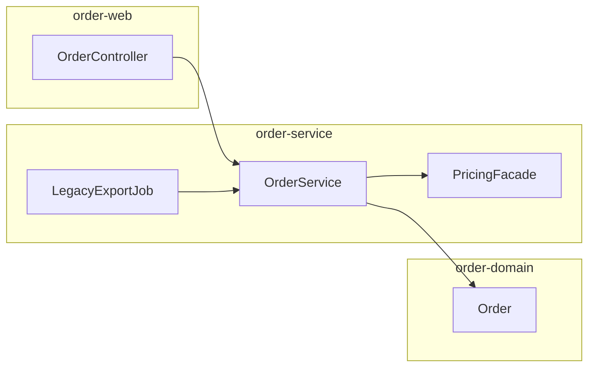

# 仓库级分析总览（样例）：`order-platform`

> 编号 **0.x**：仓库级总览。虚构项目 **order-platform**，演示「分层汇总」阶段的人读产出。数据与 `1.2-graph.json`、`1.3-module_tree.json`、`1.4-entrypoints.json` 对齐。

## 1. 快照与可复现性

- **提交**：`a1b2c3d4e5f6789012345678901234567890abcd`（见 `1.1-analysis_manifest.json`）
- **JDK / 构建**：8u292，Maven 3.6.3，profiles：`prod-db`, `legacy-security`

## 2. 一句话架构

三层 Maven 多模块：**Web（WAR）→ Service（业务与批处理）→ Domain（模型）**；对外 HTTP 由 Spring MVC 暴露；定价通过 **Java SPI** 可插拔；夜间批处理通过 **Quartz** 调度。

## 3. 模块协作（Mermaid）

## 4. 入口索引

| 类型 | 标识 | 说明 |
|------|------|------|
| REST | `OrderController` | `/api/v1/orders` |
| Main | `ReindexMain` | 运维重索引工具（样例条目中为占位） |
| Job | `LegacyExportJob` | 凌晨导出 |
| SPI | `LegacyPricingProvider` | `META-INF/services` |

完整列表见 `1.4-entrypoints.json`。

## 5. 分解树摘要

- **Web**：体量小，叶子 `controllers` 可直接人工走查。  
- **Service**：体量大，已拆 `service-core` 与 `batch-jobs` 两叶子（见 `1.3-module_tree.json`）。  
- **Domain**：以 `domain-model` 单叶子为主，变更需与 Service 事务边界联合评审。

## 6. 子文档索引（按编号层级）

| 编号 | 文件 | 用途 |
|------|------|------|
| 0.1 | `0.1-REPOSITORY_OVERVIEW.md` | 本文件：仓库级总览 |
| 1.1 | `1.1-analysis_manifest.json` | 版本锚定与工具链元数据 |
| 1.2 | `1.2-graph.json` | 统一 `depends_on` 有向图 |
| 1.3 | `1.3-module_tree.json` | 分层模块树与指标 |
| 1.4 | `1.4-entrypoints.json` | 入口点清单 |
| 2.1 | `2.1-leaf_order-service-core.md` | 典型叶子分析报告 |
| 2.2 | `2.2-rubric_eval.sample.json` | 可选评估聚合（CodeWikiBench 风格样例） |
